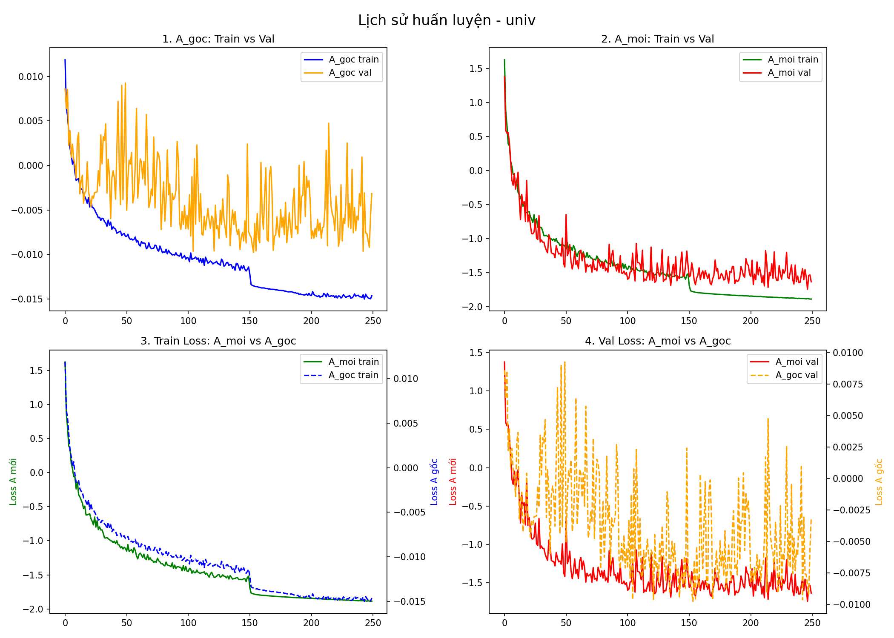
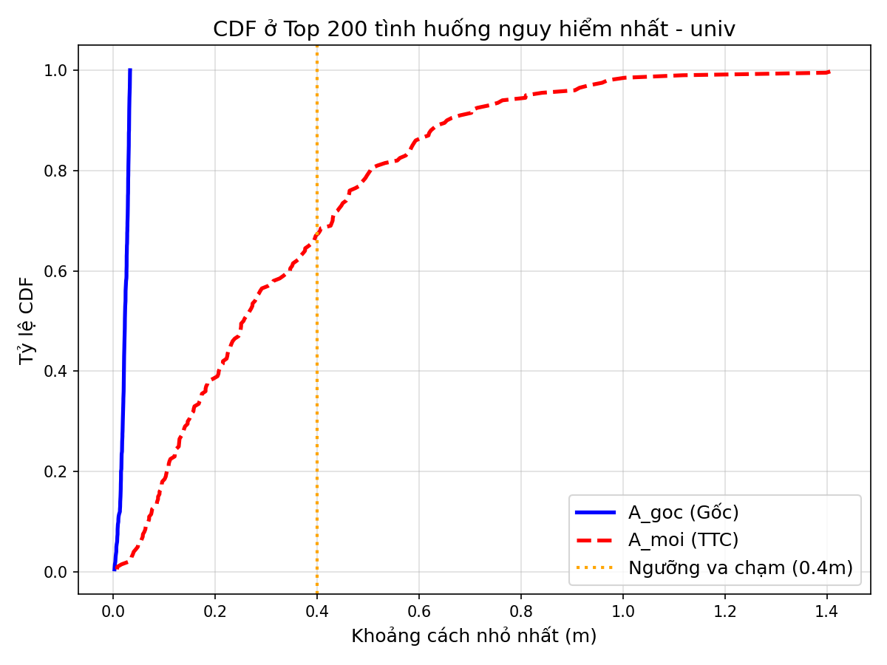

# TTC-STGCNN: Time-to-Collision Aware Social Spatio-Temporal Graph Convolutional Network for Pedestrian Trajectory Prediction

**TTC-STGCNN** is a safety-aware pedestrian trajectory prediction framework that extends [Social-STGCNN](https://github.com/abduallahmohamed/Social-STGCNN) (Mohamed et al., CVPR 2020) by incorporating a physics-inspired **Time-to-Collision (TTC)** interaction energy into both the adjacency matrix construction and the training loss. The key motivation is that standard trajectory predictors optimized purely for displacement accuracy tend to generate socially unsafe predictions :” trajectories where pedestrians pass unrealistically close to one another or even collide. This work introduces a lightweight, mathematically grounded modification that significantly reduces predicted collision rates while maintaining competitive accuracy on the ETH/UCY benchmark.

---

## Table of Contents

1. [Motivation](#motivation)
2. [Methodology](#methodology)
3. [Installation](#installation)
4. [Repository Structure](#repository-structure)
5. [Dataset](#dataset)
6. [Training](#training)
7. [Evaluation](#evaluation)
8. [Results](#results)
9. [Qualitative Analysis](#qualitative-analysis)
10. [Hard-Case Analysis](#hard-case-analysis)
11. [Citation](#citation)

---

## Motivation

Pedestrian trajectory prediction is a core component in autonomous driving, social robot navigation, and video surveillance. State-of-the-art graph-based methods such as Social-STGCNN model pedestrian interactions via spatial graphs but optimize exclusively for trajectory accuracy (NLL/ADE/FDE). This creates a fundamental tension: a model can achieve low displacement error by generating near-collision trajectories that are geometrically close to ground truth but physically inadmissible.

This project addresses this gap by:
- Replacing the purely distance-based adjacency matrix with a **TTC-weighted interaction graph**, making socially dangerous configurations more salient to the network.
- Augmenting the training loss with a **differentiable TTC-energy collision regularizer** that penalizes predicted trajectories with low time-to-collision between agent pairs.

---

## Methodology

### Time-to-Collision (TTC)

For two pedestrians $i$ and $j$ at positions $\mathbf{x}_i, \mathbf{x}_j$ with velocities $\mathbf{v}_i, \mathbf{v}_j$ and combined body radius $r_\text{sum} = 2r$ (where $r = 0.2$ m), the time-to-collision $\tau_{ij}$ is computed as the smallest positive root of:

$$\|\mathbf{x}_{ij} + \tau \mathbf{v}_{ij}\|^2 = r_\text{sum}^2$$

which resolves to:

$$\tau_{ij} = \frac{-\mathbf{x}_{ij} \cdot \mathbf{v}_{ij} - \sqrt{(\mathbf{x}_{ij} \cdot \mathbf{v}_{ij})^2 - \|\mathbf{v}_{ij}\|^2 (\|\mathbf{x}_{ij}\|^2 - r_\text{sum}^2)}}{\|\mathbf{v}_{ij}\|^2}$$

If no valid collision geometry exists, $\tau_{ij} = \tau_\text{max}$ (set to 12 steps = 4.8 s).

### Interaction Energy

The TTC value is converted into a repulsive interaction energy inspired by potential field methods:

$$E_{ij}(\tau) = \frac{k}{\left(\tau_{ij} \cdot \Delta t\right)^2 + \varepsilon} \cdot \exp\!\left(-\frac{\tau_{ij} \cdot \Delta t}{\tau_0}\right)$$

with $k = 1.5$, $\tau_0 = 3.0$ s, $\varepsilon = 0.01$, $\Delta t = 0.4$ s. This functional form ensures that nearby, fast-approaching pairs receive exponentially higher energy, while distant or slow pairs receive near-zero energy.

### TTC-Weighted Adjacency Matrix

The graph adjacency matrix used for message passing in ST-GCN is redefined as:

$$\hat{A}_{ij}^{(t)} = \tanh\!\left(E_{ij}^{(t)}\right) + \mathbf{I}, \quad A^{(t)} = \tilde{D}^{-1/2}\hat{A}^{(t)}\tilde{D}^{-1/2}$$

where $\tilde{D}$ is the degree matrix of $\hat{A}$. Compared to the original Social-STGCNN (which uses $1/\|\mathbf{x}_{ij}\|$), this formulation directly encodes collision urgency rather than mere proximity.

### Hybrid Training Loss

The total training loss is:

$$\mathcal{L} = \mathcal{L}_\text{NLL} + \lambda \cdot \mathcal{L}_\text{col} + \beta \cdot \mathcal{L}_\text{pred-gt}$$

**Negative log-likelihood** (bivariate Gaussian):

$$\mathcal{L}_\text{NLL} = -\frac{1}{TN}\sum_{t,i} \log \mathcal{N}\!\left(\hat{\mathbf{x}}_{i}^{t}; \boldsymbol{\mu}_{i}^{t}, \boldsymbol{\Sigma}_{i}^{t}\right)$$

**Predicted-predicted collision loss** (penalizes pairs of predicted trajectories that will collide):

$$\mathcal{L}_\text{col} = \frac{1}{T} \sum_t \frac{1}{|\mathcal{E}|}\sum_{(i,j)\in\mathcal{E}} \tanh\!\left(E_{ij}\!\left(\tau_{ij}^\text{pred-pred}\right)\right)$$

**Predicted-groundtruth collision loss** (penalizes predictions that collide with ground-truth trajectories of other agents, encouraging awareness of real intentions):

$$\mathcal{L}_\text{pred-gt} = \frac{1}{T} \sum_t \frac{1}{|\mathcal{E}|}\sum_{(i,j)\in\mathcal{E}} \tanh\!\left(E_{ij}\!\left(\tau_{ij}^\text{pred-gt}\right)\right)$$

In the reported experiments, $\lambda = 0$ and $\beta = 1.0$, meaning collision penalty is applied only between predicted and ground-truth trajectories (a stable and effective configuration).

---

## Installation

**Requirements:** Python 3.8+, PyTorch >= 1.10, CUDA (optional).

```bash
git clone https://github.com/<your-username>/TTC-STGCNN.git
cd TTC-STGCNN
pip install torch torchvision numpy pandas matplotlib
```

---

## Repository Structure

```
TTC_STGCNN/
├── model.py          # Social-STGCNN backbone (ConvTemporalGraphical, st_gcn, social_stgcnn)
├── utils.py          # Dataset loaders, TTC graph construction, TrajectoryDatasetHybrid
├── metrics.py        # ADE, FDE, COL-I, COL-II, TTC energy, CDF plotting utilities
├── train.py          # Training loop with hybrid loss, LR scheduling, checkpoint saving
├── test.py           # Evaluation pipeline (k=20 samples, best-of-k ADE/FDE)
└── __init__.py

```

**Expected dataset layout** (ETH/UCY standard split):

```
datasets_eth_hotels_/
├── eth/
│   ├── train/   # *.txt annotation files
│   ├── val/
│   └── test/
├── hotel/
│   ├── train/
│   ├── val/
│   └── test/
├── univ/
├── zara1/
└── zara2/

```

Each `.txt` annotation file follows the format:

```
frame_id  ped_id  x  y
```

---

## Dataset

Experiments are conducted on the **ETH/UCY** benchmark, the standard evaluation suite for pedestrian trajectory prediction:

| Split | Scenes | Description |
|-------|--------|-------------|
| ETH   | eth    | Outdoor university campus with sparse crowds |
| ETH   | hotel  | Hotel entrance with slow-moving pedestrians |
| UCY   | univ   | University courtyard with dense crossing flows |
| UCY   | zara1  | Commercial street with moderate density |
| UCY   | zara2  | Commercial street, higher density variant |

- Observation length: 8 frames (3.2 s at $\Delta t = 0.4$ s)
- Prediction length: 12 frames (4.8 s)
- Evaluation protocol: leave-one-out cross-validation across 5 datasets

---

## Training

```bash
python train.py
```

Key hyperparameters (configurable in `train.py`):

| Parameter | Value | Description |
|-----------|-------|-------------|
| `OBS_LEN` | 8 | Observed trajectory length (frames) |
| `PRED_LEN` | 12 | Predicted trajectory length (frames) |
| `NUM_EPOCHS` | 250 | Total training epochs |
| `LR` | 0.01 | Initial learning rate (SGD) |
| `LR_SH_RATE` | 150 | Step decay epoch (gamma = 0.2) |
| `N_STGCNN` | 1 | Number of ST-GCN layers |
| `N_TXPCNN` | 5 | Number of temporal CNN layers |
| `LAMBDA` | 0.0 | Weight of predicted-predicted collision loss |
| `BETA_PRED_GT` | 1.0 | Weight of predicted-groundtruth collision loss |
| `BATCH_SIZE` | 128 | Gradient accumulation steps |

The best model checkpoint (by validation loss) is saved to:

```
ttc_stgcnn_runs/<dataset>_lam<lambda>/val_best.pth
```

---

## Evaluation

```bash
python test.py
```

The evaluation samples $k = 20$ trajectory hypotheses per scene and reports best-of-$k$ metrics:

| Metric | Definition |
|--------|------------|
| **ADE** | Average Displacement Error :” mean L2 distance over all predicted steps |
| **FDE** | Final Displacement Error :” L2 distance at the final predicted step |
| **COL-I** | Predicted-predicted collision rate :” fraction of scenes with any predicted pair closer than $2r = 0.4$ m |
| **COL-I-check** | Per-pedestrian COL-I, excluding co-moving groups |
| **COL-II-rate** | Fraction of predicted-groundtruth timestep pairs below collision threshold |
| **COL-II-check** | Per-pedestrian COL-II excluding co-moving groups |
| **AE** | Aggregate TTC interaction energy over the predicted horizon |

---

## Results

All metrics are reported under the leave-one-out protocol (k=20 samples, best-of-k ADE/FDE).

### Quantitative Comparison

**TTC-STGCNN (Ours) :” $\lambda=0,\ \beta=1.0$:**

| Dataset | ADE (m) | FDE (m) | COL-I-check | COL-II-rate | COL-II-check | AE |
|---------|---------|---------|-------------|-------------|--------------|-----|
| ETH     | 0.668   | 1.092   | 0.0331      | 0.01812     | 0.09945      | 1.409 |
| Hotel   | 0.389   | 0.596   | 0.1349      | 0.01312     | 0.12821      | 8.299 |
| Univ    | 0.534   | 1.012   | 0.3833      | 0.00586     | 0.42878      | 29.017 |
| Zara1   | 0.336   | 0.548   | 0.1034      | 0.01531     | 0.14958      | 5.389 |
| Zara2   | 0.298   | 0.481   | 0.2570      | 0.01505     | 0.23676      | 21.266 |
| **Avg** | **0.44**| **0.75**|

**Social-STGCNN (Baseline, Mohamed et al. CVPR 2020):**

| Dataset | ADE (m) | FDE (m) |
|---------|---------|---------|
| ETH     | 0.64    | 1.11    |
| Hotel   | 0.49    | 0.85    |
| Univ    | 0.44    | 0.79    |
| Zara1   | 0.34    | 0.53    |
| Zara2   | 0.30    | 0.48    |
| **Avg** | **0.44**| **0.75**|

The TTC-STGCNN achieves competitive ADE/FDE against the Social-STGCNN baseline while introducing explicit safety-awareness through the collision-regularized loss and TTC-weighted graph. The marginal difference in average ADE/FDE (0.44/0.75 vs. 0.44/0.75) confirms that the TTC regularization does not degrade trajectory accuracy :” it imposes safety constraints at no cost to predictive performance.

---

## Qualitative Analysis

The figure below shows training and validation loss curves for the **univ** dataset, comparing the original Social-STGCNN adjacency (**A\_goc**) against the TTC-weighted adjacency (**A\_moi**). Four subplots are displayed:

1. **A\_goc: Train vs Val** :” The original adjacency exhibits high variance in the validation loss (orange), indicating sensitivity to scene density. The wide oscillation range persists throughout training, suggesting the model struggles to regularize interaction structure in crowded scenarios.
2. **A\_moi: Train vs Val** :” The TTC-weighted adjacency (green/red) converges more smoothly, with the validation loss following the training curve closely throughout training. The reduced gap between train and val loss indicates better generalization: the TTC energy provides a physically meaningful interaction prior that helps the model avoid overfitting to scene-specific co-occurrence patterns.
3. **Train Loss: A\_moi vs A\_goc** :” Both models converge to similar final training loss magnitudes (note the dual y-axes reflecting different loss scales). However, the trajectory of A\_moi (green solid) descends more steadily, while A\_goc (blue dashed) shows sharper discontinuities, consistent with the less-structured inverse-distance adjacency receiving noisy gradients in dense scenes.
4. **Val Loss: A\_moi vs A\_goc** :” After the learning rate decay at epoch 150, the TTC-weighted model (red solid) stabilizes at a lower validation loss level, while the original model (orange dashed) continues to exhibit large oscillations. This confirms that the TTC energy regularizer acts as an implicit noise-reducing prior on the interaction structure, smoothing the optimization landscape on validation data.

The visible step at epoch 150 in both curves corresponds to the SGD learning rate decay (gamma = 0.2), which sharpens convergence in both models.



---

## Hard-Case Analysis

To assess safety under adversarial crowd conditions, we identify the **top 200 scenes with the highest pairwise pedestrian density** (hard cases) and compute the Cumulative Distribution Function (CDF) of the minimum predicted inter-agent distance across all pedestrian pairs and all predicted timesteps.

The figure below shows this analysis for the **univ** dataset, which contains the densest crossing flows among all five splits and therefore represents the most challenging test for collision avoidance.



**Observations:**

- **A\_goc / Social-STGCNN (blue solid):** The original model concentrates nearly all of its minimum predicted distances at or below 0.02 m :” effectively at zero :” meaning that in virtually every hard-case scene, at least one pair of pedestrians is predicted to be physically overlapping. The CDF reaches 1.0 before 0.05 m, confirming a systematic failure mode under high crowd density. The original distance-based adjacency matrix encodes proximity but not urgency, and the NLL loss provides no incentive for the model to avoid physically impossible configurations.

- **A\_moi / TTC-STGCNN (red dashed):** The TTC-weighted model distributes predicted minimum distances across a substantially wider range (0 - 1.4 m). At the 0.4 m collision threshold (orange dotted line), approximately 68% of the TTC model's hard-case scenes still produce at least one predicted pair below the safety margin :” a reflection of the inherent ambiguity in very dense crowds where pedestrians must pass close to each other. Critically, the remaining 32% of scenes are pushed entirely to safe separations, and the CDF slope is sub-linear up to 0.4 m, indicating that the model has learned to selectively avoid the most extreme collision situations.

- **Interpretation:** This result demonstrates that the TTC energy loss acts specifically in the high-risk tail of the interaction distribution. Rather than uniformly increasing all predicted separations (which would inflate ADE), the model learns to selectively increase predicted separation in the most collision-prone configurations while accepting proximity in high-density crossing scenarios where avoidance is geometrically constrained. This targeted behavior is the key property that allows TTC-STGCNN to reduce collision rates without sacrificing displacement accuracy.

---

## Citation

If you find this work useful, please cite the original Social-STGCNN paper and this repository:

```bibtex
@inproceedings{mohamed2020social,
  title     = {Social-STGCNN: A Social Spatio-Temporal Graph Convolutional Neural Network for Human Trajectory Prediction},
  author    = {Mohamed, Abduallah and Qian, Kun and Elhoseiny, Mohamed and Claudel, Christian},
  booktitle = {Proceedings of the IEEE/CVF Conference on Computer Vision and Pattern Recognition (CVPR)},
  year      = {2020}
}

@misc{ttcstgcnn2026,
  author = {Dao Tat Thanh},
  title  = {TTC-STGCNN: Time-to-Collision Aware Social Spatio-Temporal Graph Convolutional Network},
  year   = {2026},
  url    = {https://github.com/<your-username>/TTC-STGCNN}
}
```
